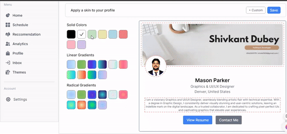
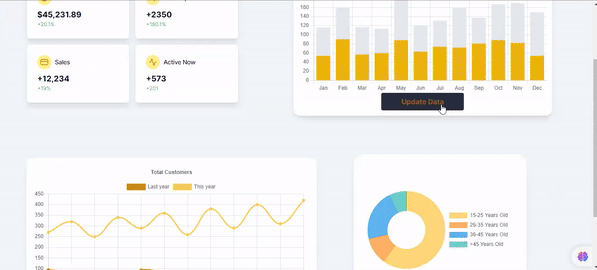
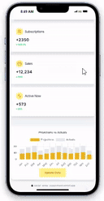

# SocialSense Assignment
---
[Visit Yourself](https://social-sense-assignment.vercel.app/)
----------
- Frame1
  >In this frame, I needed to create a theme changer which will change the theme according to the color picked by user
- Frame2
  >In this frame, I needed to create a dynamic dashboard which contains all the graphs and all and changes randomly.

## Frame-1 (Theme changer)
---
 [Checkout Frame-1](https://social-sense-assignment.vercel.app/frame1)
---
  ### Feature
  - Changes theme color with the choosed color by the user.
  - Responsive for both desktop as well as for small screens.
---
### Desktop Version

===
### Mobile Version

## Frame-2 (Dynamic Dashboard)
---
[Checkout Frame-2](https://social-sense-assignment.vercel.app/frame2)
---
  ### Feature
  - Dynamic changes data using a randomizer function.
  - Responsive for both desktop as well as for small screens.
  - Interactive Graphs
---
### Desktop Version

===
### Mobile Version

---

